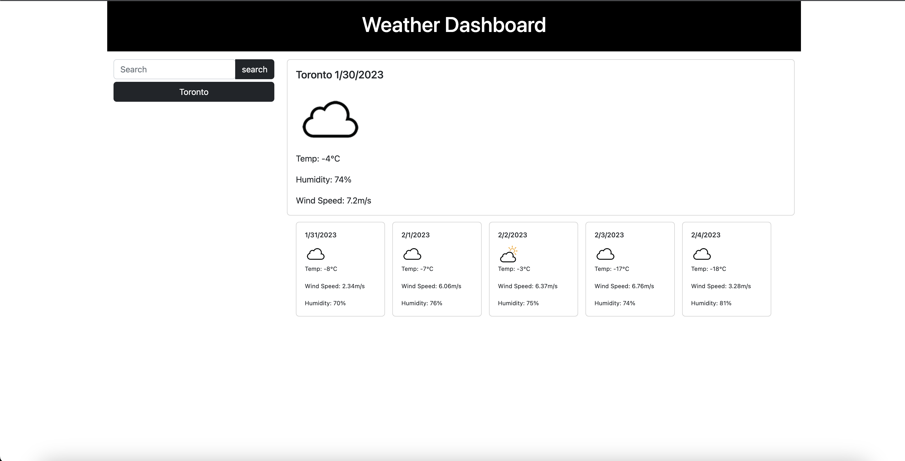

# 06 Server-Side APIs: Weather Dashboard

## Description
My motivation for making this weather app was to practice my skills using server side API's and making/handling requests. I furthered my understanding of using serverside API's and handling requests using javascript's fetch() object. Specifically, I learned how important it is navigate server documentation and maneuver the DOM to update the page using the returned JSON object. In my next application I'd like to dynamically create HTML elements and update the page instead of having hard coded HTML. Having the hard coded HTML makes my page less adaptable and it makes it difficult to make changes.  

## Deployment
<a href="https://john-abou.github.io/weather-app/">Webpage link</a>

## Usage
The webpage has been made for anyone who would like to view the upcoming weather in a city. The user is automatically shown Toronto's weather on the initailization of the webpage. After that, the user can type in the name of any city into the search bar, as long as the enter the correct spelling - the user will be shown the current weather and the weather for the next 5 days in that city. 

### Desktop webpage screenshot
* <b>Start page on desktop</b>
 

## Credits
Credits to the discord group for working together to figure out some of the trickier though processes. Also, never forget the MVP's of learning -- stack overflow and google.

## License
This webpage has been made commercially available under the MIT license.

- - -
© Copyright. john-abou. The one piece is real 🏴‍☠
