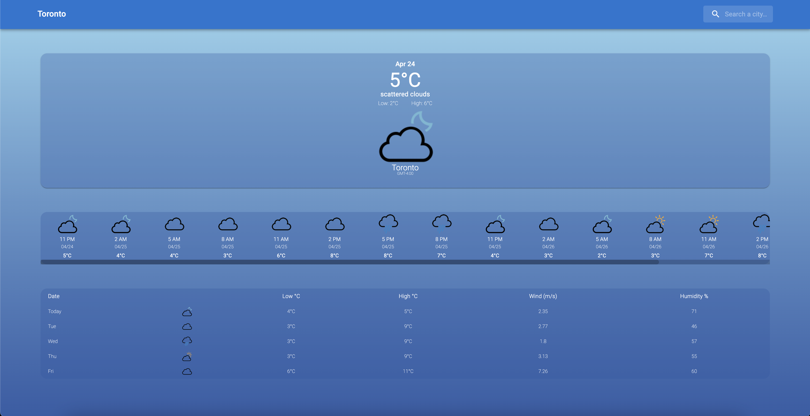

# 06 Server-Side APIs: Weather Dashboard

## Description
My motivation for refactoring my old weather app was to get more practice with React, improve the UI design and improve the functionality of the app. In the re-design, I removed the static containers I hard-coded in HTML and instead dynamically created 2 new features based on the data received from the API. The first feature is a 2 day detailed forecast that contains a summary of the weather for every 3 hours - itt can be used to get for more detailed insights into the weather over the next 2 days. The second feature is a table that summarizes the next 5 days weather -- it includes the expected low/high temps, wind and humidity. The app is also responsive and can be used on mobile devices.

Future development for this app will include a feature that allows the user to save their favorite cities and view them on the page.

## Deployment
<a href="https://john-abou.github.io/weather-app/">Webpage link</a>

## Usage
The webpage has been made for anyone who would like to view the upcoming weather in a city. The user is automatically shown Toronto's weather on the initailization of the webpage. After that, the user can type in the name of any city into the search bar, as long as the enter the correct spelling - the user will be shown the current weather and the weather for the next 5 days in that city. 

## License
This webpage has been made commercially available under the MIT license.

- - -
© Copyright. john-abou. The one piece is real 🏴‍☠

Performer.id is one of the main things we need from seat geek --- tbd how we get it -- 

Events End point
datetime_utc is the date time of the event

